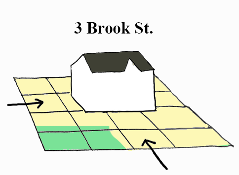

# geodata_geocoding
This is a collection of notebooks demonstrating how to programmatically geocode a tabular data file. Geocoding is the process of retrieving coordinate data from addresses, and can involve either a lookup from a database or address interpolation along a street. Before geocoding, you'll typically want to format your data into a suitable format. This includes separating geographic information into addresses, streets, city, and state columns, and converting all addresses to a number.

Demonstrated methods include the U.S. Census Batch Geocoder, the RI E911 database geocoder, and the ArcGIS World Geocoding Service. Further options, such as OpenStreetMap's Nominatim, can be accessed through Geopy and the corresponding section of the notebook.
